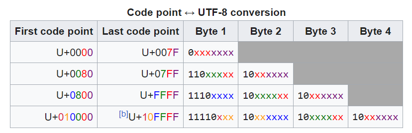

# Rust Notes

## Closures

#### rust functions cannot capture variables from its environment

for example in python

```
def outer_function(x):
    def inner_function(y):
        return x + y
    return inner_function
```

**inner function** is able to access x from the outer function, however, this is not possible in rust\
rust achieves this by using closures

```
fn outer_function(x: i32) -> impl Fn(i32) -> i32 {
    let inner_function = move |y| x + y;
    inner_function
}
```

#### Borrows happen as soon as the closure is defined, not when it is used

```
fn main() {
    let mut list = vec![1, 2, 3];
    println!("Before defining closure: {:?}", list);

    let mut borrows_mutably = || list.push(7);

    println!("Before calling closure: {:?}", list);
    borrows_mutably();
    println!("After calling closure: {:?}", list);
}
```

this wont work because declaration of the closure creates an mutable borrow and the println tries to create an immutable borrow before the mutable borrow's lifetime is over

---

## Macros

#### A simple example of a declarative Macro that writes code for implementing a trait

```
#[derive(Debug)]
pub struct Duration {
    earth_years: f64,
}

impl From<u64> for Duration {
    fn from(s: u64) -> Self {
        let earth_years = s as f64 / 31557600.0;
        Duration { earth_years }
    }
}

pub trait Planet {
    const YEAR_RATIO: f64;
    fn years_during(d: &Duration) -> f64 {
        d.earth_years / Self::YEAR_RATIO
    }
}

macro_rules! planet {
    ($x:ident, $y:expr) => {
        pub struct $x;
        impl Planet for $x {
            const YEAR_RATIO: f64 = $y;
        }
    }
}

planet!(Mercury, 0.2408467);
planet!(Venus, 0.61519726);
planet!(Earth, 1.0);
planet!(Mars, 1.8808158);
planet!(Jupiter, 11.862615);
planet!(Saturn, 29.447498);
planet!(Uranus, 84.016846);
planet!(Neptune, 164.79132);
```

## Traits

#### A struct cannot have multiple implementations of a trait.

- this doesn't work because MyStruct implements debug and MyTrait

```
#[derive(Debug)]
struct MyStruct;

trait MyTrait {
    fn do_something(&self);
}


impl<E: std::fmt::Debug> MyTrait for E {
    fn do_something(&self) {}
}

// This is a specific implementation for SpecificError
impl MyTrait for MyStruct {
    fn do_something(&self) {}
}

fn main() {
    let specific_error = MyStruct;
    specific_error.do_something();
    "hi".do_something();
}
```

- this works beccause MyStruct can only use its own MyTrait

```
struct MyStruct;

trait MyTrait {
    fn do_something(&self);
}


impl<E: std::fmt::Debug> MyTrait for E {
    fn do_something(&self) {}
}

// This is a specific implementation for SpecificError
impl MyTrait for MyStruct {
    fn do_something(&self) {}
}

fn main() {
    let specific_error = MyStruct;
    specific_error.do_something();
    "hi".do_something();
}
```

- this doesnt work because there could be a struct that implements both debug and display

```
struct MyStruct;

trait MyTrait {
    fn do_something(&self);
}

// This is a generic implementation for any type E that implements std::error::Error
impl<E: std::fmt::Display> MyTrait for E {
    fn do_something(&self) {}
}

impl<E: std::fmt::Debug> MyTrait for E {
    fn do_something(&self) {}
}

// This is a specific implementation for SpecificError
impl MyTrait for MyStruct {
    fn do_something(&self) {}
}

fn main() {
    let specific_error = MyStruct;
    specific_error.do_something();
    "hi".do_something();
}
```

#### Default values are not supported by structs, they can be defined in implementations

Traits can have different implementations for fields or functions, but they must be specified

```
trait MyTrait {
    const MY_CONST: u8;
    fn foo();
    fn bar();
}

trait AnotherTrait {
    const MY_CONST: u8;
    fn baz();
}

struct MyFirstStruct;

impl MyFirstStruct {
    const MY_CONST: u8 = 0;
}

impl MyTrait for MyFirstStruct {
    const MY_CONST: u8 = 42;
    fn foo() {}
    fn bar() {}
}

impl AnotherTrait for MyFirstStruct {
    const MY_CONST: u8 = 100;
    fn baz() {}
}

fn main() {
    println!("MyTrait constant: {}", <MyFirstStruct as MyTrait>::MY_CONST); // Prints 42
    println!(
        "AnotherTrait constant: {}",
        <MyFirstStruct as AnotherTrait>::MY_CONST
    ); // Prints 100
    println!("MyFirstStruct constant: {}", MyFirstStruct::MY_CONST); // Prints 0
}
```

## Errors

#### how to implement your own error by hand (don't do this, use thiserror)

implement Debug, Display, then implement std::error::Error (can be empty unless you want to override)

```
#[derive(Debug)]
pub struct MyError;

impl std::fmt::Display for MyError {
    fn fmt(&self, f: &mut std::fmt::Formatter<'_>) -> std::fmt::Result {
        f.write_str("my error")
    }
}
impl std::error::Error for MyError {}
```

## Vectors, Strings, and Slices

https://stackoverflow.com/questions/61151041/what-is-the-difference-between-a-slice-and-reference-in-rust

Fat pointer: a pointer to the data, and the length of the data

- A Vec<T> is an owned version of &[T] that can grow
- both Vec<T> and &[T] are fat pointers
- dereferencing Vec<T> yields [T], but the length can't be known at compile time!!
- String is to &str like Vec<T> is to &[T]
- In the case of strings, T is a u8, with a special guarantee that this sequence of u8 obeys utf-8
- Note that T isn't char because char is always 4 bytes, string use variable length encoding from 1-4 bytes for each character
- container[index] is actually syntactic sugar for `*container.index(index)` https://doc.rust-lang.org/std/ops/trait.Index.html
  - it first implicit derefs when calling index, which returns a reference. then returns a deref of it
  - its probably because single indexes want to return the owned object

```
use std::ops::{Index, RangeFull};

fn main() {
let my_obj = [1, 2, 3, 4, 5];
let my_slice = &my_obj[..];
let my_slice2 = &*my_obj.index(RangeFull);
}

```

With that in mind

- String = Vec<u8>
- &str = &[u8]
- str = [u8; n]

#### Deref coersion allows conversions as long as input is a reference

https://doc.rust-lang.org/std/ops/trait.Deref.html
automatically turning a &T into a &U, where some amount of \*T would result in a U

This is ok!

```

let my_string = String::from("Abc");
let my_str: &str = &my_string;

```

This is also ok!

```
let my_string = &String::from("hello world");
let my_str: &str = my_string;
```

This is not!

```
let my_string = String::from("hello world");
let my_str: &str = my_string;
```

A custom implemented example

```
use std::ops::Deref;

struct DerefExample<T> {
    value: T,
}

impl<T> Deref for DerefExample<T> {
    type Target = T;

    fn deref(&self) -> &T {
        &self.value
    }
}

fn main() {
    let x = DerefExample { value: 'a' };
    let a: &char = &x;
}
```

## Unicode Bogus

Every character has a unicode code point, which is a hexadecimal number of up to 5 digits (technically 6 but lets ignore that)

This 5 digit number is then converted to binary, which will be 5 8-bit bytes

To encode this into utf-8, this hexadecimal code point is converted to binary, and then based on the number of bits, it is encoded into 1-4 bytes

0-7 bits: 1 byte  
8-11 bits: 2 bytes  
12-16 bits: 3 bytes  
17-21 bits: 4 bytes



These 4 bytes, including the padding, converted back to decimal, is what you get when you print String.to_bytes()

When you call as u8 on a char, it returns you the last 8 bits of the binary representation of the unicode code point converted to decimal, so anything below C0, or 11000000 will be identical to the last byte encoded as utf8, since the second byte is always 10xxxxxx

For example, hexadecimal C0 is 11000000, so the as u8 will return 11000000, which is 192, however, the actual utf-8 encoding of C0 is 110|00011 10|000000, which is 195 128.

In the case of BF, the hexadecimal is 10111111, so as u8 will return 191 and the utf-8 encoding is 110|00010 10|111111, which is 175 191, which has the same last byte

Because of the 10 prefix, all bytes except the first of a utf-8 encoded character will not surpass 10|111111, or BF.

As long as the character is less than or equal to 8 bits, converting to u8 and back will be the same, but anything above that will lose information. So the maximum value of a char that can be converted to u8 and back is FF, which is 255, which is 11111111 in binary, which is 8 bits

In conclusion  
First convert codepoint to binary.  
as u8: truncate to least significant byte (8 bits), return as decimal
as_bytes: convert to utf-8, return array of bytes in decimal

## Functional Programming

- Folding is useful whenever you have a collection of something, and want to produce a single value from it.

## Passing parameters for functions

It's really, really important to understand ownership, borrowing, and later on, lifetimes. But here's some rules of thumb.

- If your function needs to take ownership of the data, pass by value.
- If your function only needs to read the data, pass a reference.
- If your function needs to change the data, pass a mutable reference.

## Filter vs Map

https://users.rust-lang.org/t/why-does-map-not-require-a-reference-when-filter-does/108516/2

- Filter closures give you a reference because it might need the data later on i.e. if the filter returns true, map closures give you the data because it doesn't need the data later on i.e. it's going to be transformed into something else
- This is why filter_map gives you the data, since it does a transformation

## Pattern Matching
Pattern matching does not check match guards, it only checks the arms for exhaustiveness. That's why the following code won't work even though we know its exhaustive, the compiler knows you only checked for Some(x) that isn't exhaustive, so you need another one to exhaust the remaining values of x
```
fn main() {
    let num = Some(4);

    match num {
        Some(x) if x % 2 == 0 => println!("The number {} is even", x),
        Some(x) if x % 2 != 0 => println!("The number {} is odd", x),
        None => (),
    }
}
```
